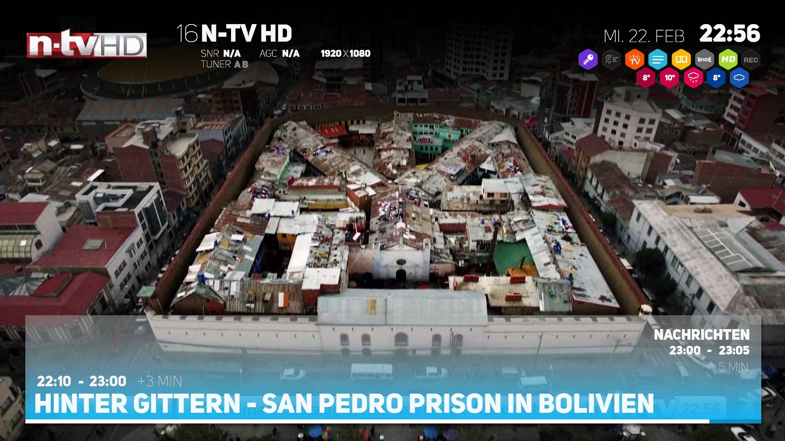
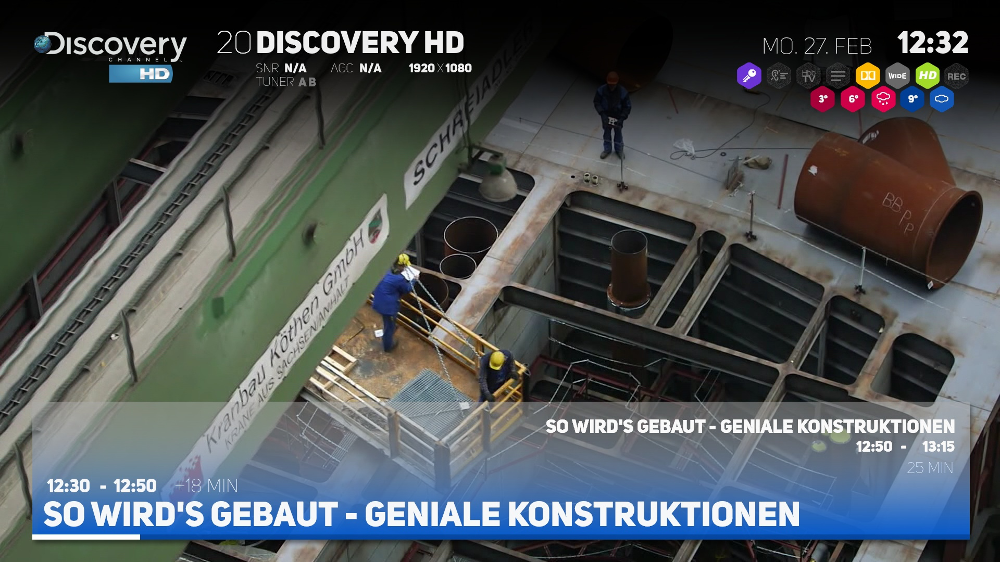
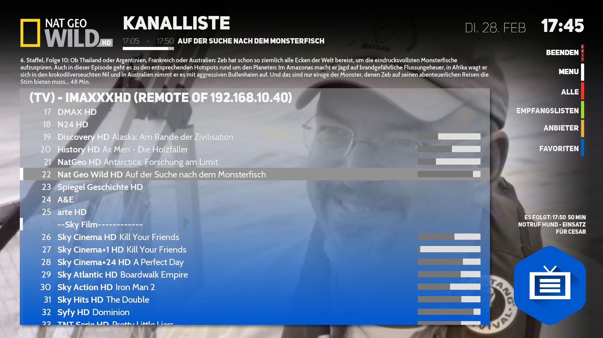
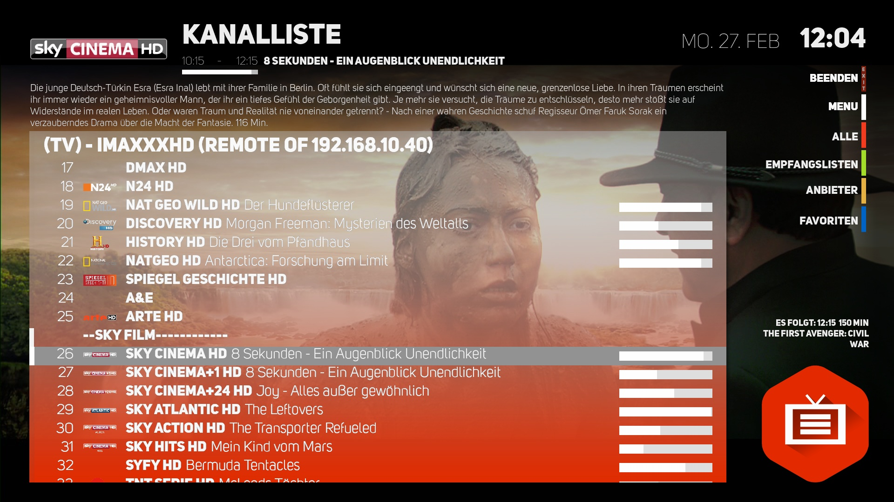
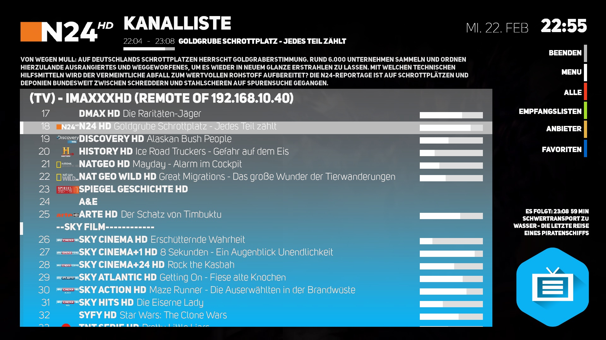
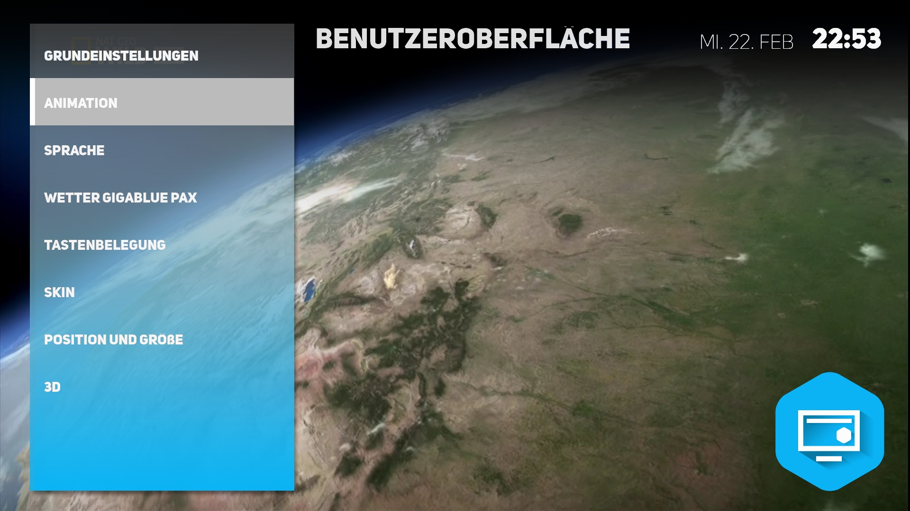
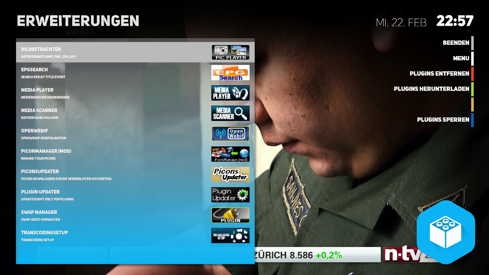
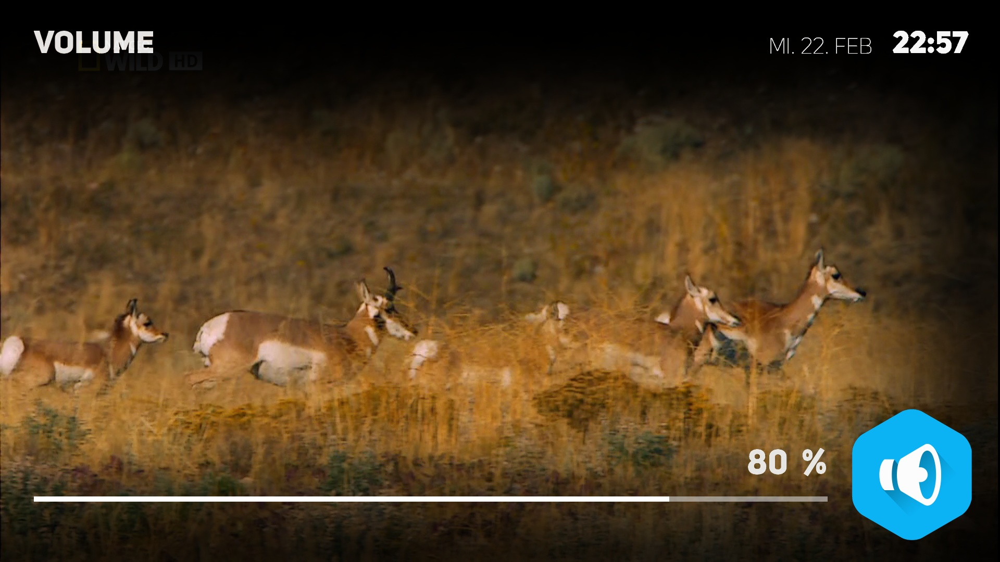
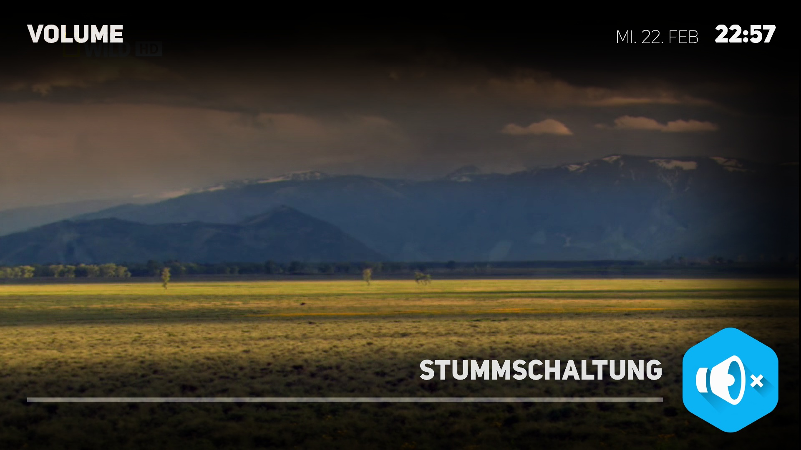

Gigablue Universe HD
========

Recommended Picons: HD Picons 300x130! Use Picon Manager plugin to download!

skin-background-colored - lightblue: #0061b8da; blue: #007392bd; violett: #00a658d3; red: #00d67c67; green: #00b5d364; pink: #00d7618b

skin-transparency - more transparent: #ffaaaaaa; default: #bbaaaaaa; less transparent: #66aaaaaa; not transparent: #00aaaaaa

##**Screenshots**

###InfoBar

###InfoBar blue

###SecondInfoBar

###Channel list

###Channel list red

###Channel list with picons

###Main menu

###Menu green

###GUI menu

###Plugins

###Volume

###Mute

